# Results of Analysis

## Overview

The purpose of this analysis is to experiment with Logistic Regression and Ensemble algorithms, in conjunction with Oversampling and Undersampling techniques.

## Results

Please refer to the accompanying notebooks for code used. The following list summarizes the results of the analysis:

### Logistic Regression 

#### Naive Random Oversampling

* Balanced Accuracy Score:

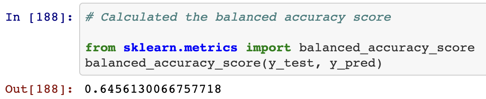

* Classification Report

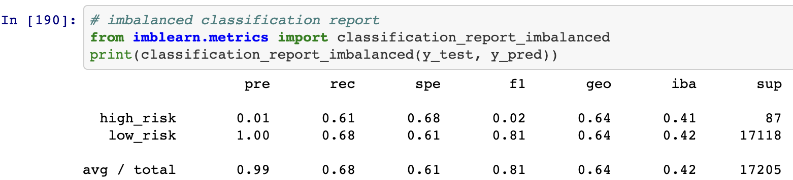

#### SMOTE

* Balanced Accuracy Score:

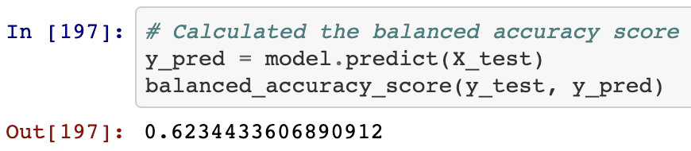

* Classification Report

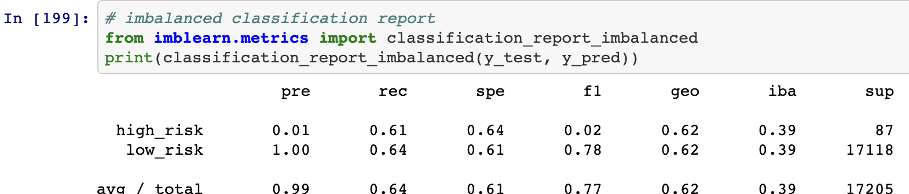

#### Undersampling

* Balanced Accuracy Score:

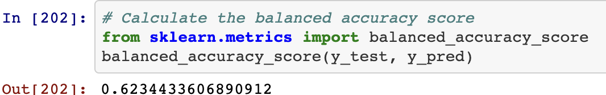

* Classification Report

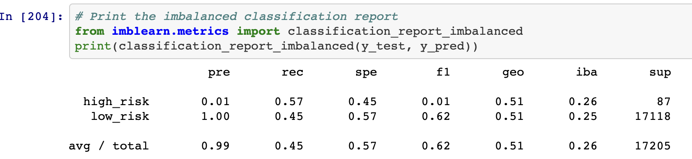

#### SMOTEENN

* Balanced Accuracy Score:

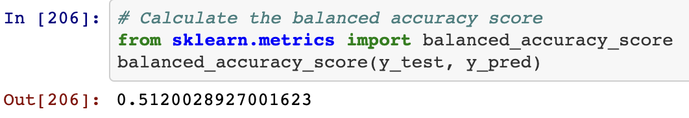

* Classification Report

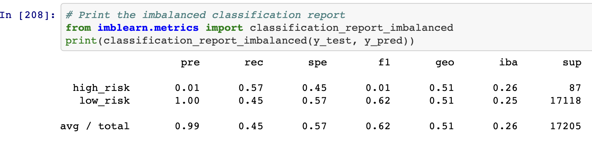

### Ensemble Algorithms

#### Balanced Random Forest

* Balanced Accuracy Score:

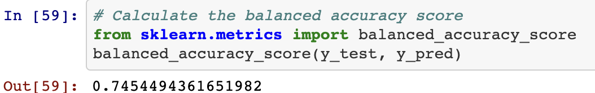

* Classification Report

#### Easy Ensemble AdaBoost

* Balanced Accuracy Score:

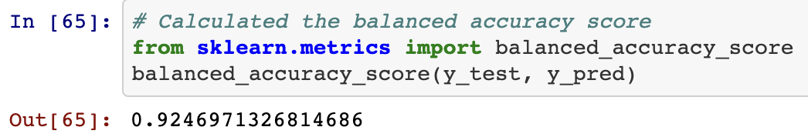

* Classification Report

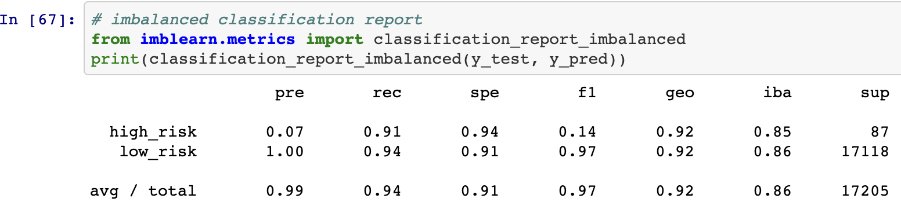

## Discussion

Based on the analysis above, I would recommend the use of Easy Ensemble AdaBoost classifier. This model received the highest accuracy score. The precision for this model comes in at 0.07, meaning that if the transaction is fraudulent, there is actually a very low chance that it is indeed fraudulent. However, the recall/sensitivity of this model is 0.90, meaning that of all fraudulent transactions, the model was able to correctly recognize 90% of those transactions. This combined with the high accuracy score is why I would recommend this model.